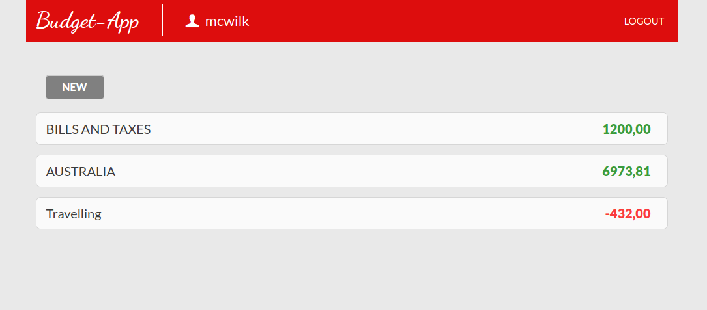
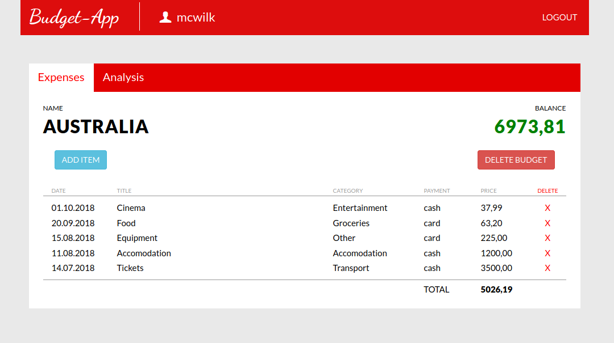
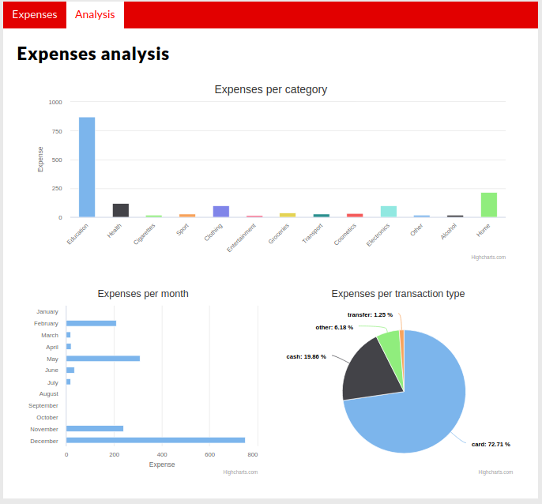

## Table of Contents
* [General info](#general-info)
* [Technologies](#technologies)
* [Screenshots](#screenshots)
* [Status](#status)
* [Sources](#sources)
* [Contact](#contact)

## General info
Application for tracking and analysing your daily spendings. 

Main functionalities:
- create private account
- login for your private dashboard
- create/delete as many budgets as yout want
- add/remove items from your budgets
- specify category for each item
- track spendings and balance
- get spendings analysis

Backend: Python/Django 

Frontend: HTML5, CSS3, Highcharts

Database: PostgreSQL

Demo available on: soon

## Technologies
* Python 3.x
* Django 2.x
* HTML5
* CSS3
* Highcharts
* PostgreSQL

## Screenshots

Screenshot 1:

Screenshot 2:

Screenshot 2:

## Status
Project is: _finished_

## Sources
Charts provided by: www.highcharts.com

## Contact
maciej.wilk04@gmail.com
